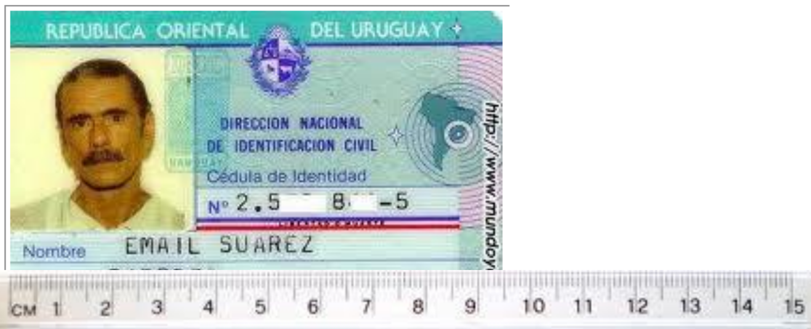
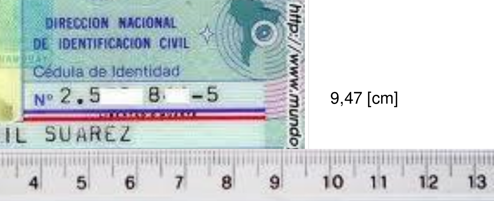
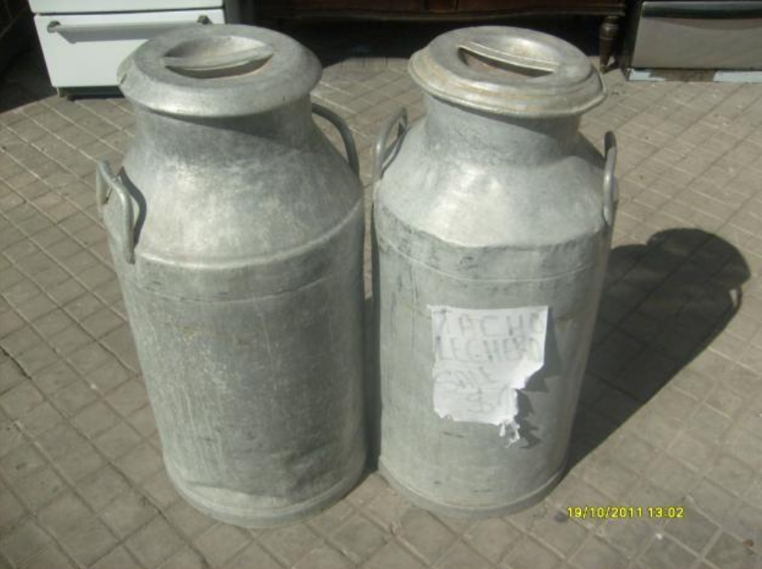
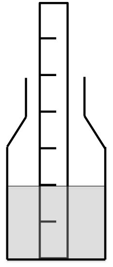
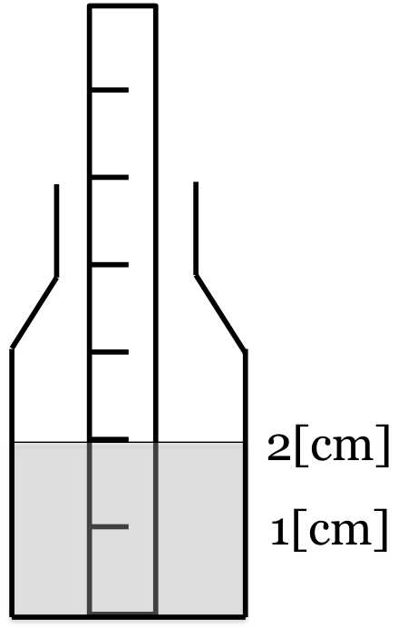

# FIS-100 Introducción a la Física {.vflex}

Departamento de Física \
Universidad Técnica Federico Santa María \
Mediciones (1)

# Objetivos de la clase {.vflex}

*   Realizar mediciones de longitud
*   Identificar el error en las mediciones
*   Operar con cantidades físicas medidas
*   Resolver un problema en el que intervienen cantidades
    físicas medidas

# Actividad 1: Primera medición {.vflex}

Tú junto al resto de los integrantes de tu grupo
debes anotar en la hoja de trabajo el resultado de
la medición del largo y ancho de una hoja de
tamaño carta. Para la medición utilizarás una
regla graduada en milímetros.

<footer>2 [min]</footer>

# ¿Cómo medir? {.vflex}

*   Para la medición de longitud estamos utilizando una
    regla, un elemento de medición manual, por ello,
    requiere que el número encontrado sea leído por
    nosotros.
*   Podemos “mejorar” la medición directa que nos
    entrega la regla.
*   Debemos hacer un esfuerzo para estimar una cifra
    más a la entregada por la regla, en este caso, estimar
    la décima de milímetro de acuerdo a nuestra
    observación.

# Figura 1 {.no-title .hflex}

# Figura 2 {.no-title .hflex}

# 9,47 [cm] {.vflex}

Esta cantidad física tiene 3 cifras significativas, la
última es una cifra incierta (el 7) ya que fue
“estimada por nosotros”.

# Actividad 2: Segunda medición {.vflex}

Repite la medición de largo y ancho de la hoja tamaño
carta tomando en cuenta la observación hecha. La
medición debe ser personal y anotada en la hoja de
trabajo del grupo.

<footer>2 [min]</footer>

# Cuento del lechero {.hflex}

# Cuento del lechero {.hflex}

# Cuento del lechero {.hflex}

Por cada centímetro hay 1[l] de leche.

# Pregunta 1 {.no-title .vflex}

1.  ¿Cuál de las siguientes longitudes fue medida con una
    regla de lechero de acuerdo a nuestro convenio?
        a)  sadasd
